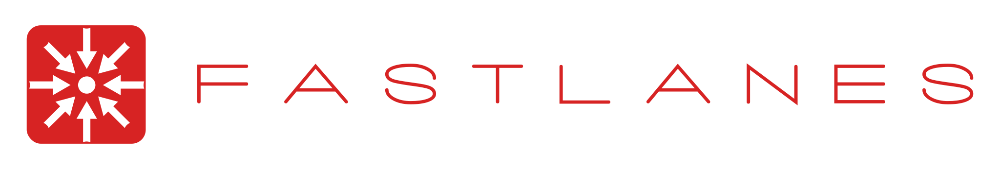

<p align="center">
  
</p>

[](LICENSE)

**Like Parquet, but with 40% better compression and 40× faster decoding.**

FastLanes features:

* **Fully SIMD-friendly with zero explicit SIMD instructions**
* **Zero dependencies**:

    * no external libraries required

---

## Documentation

* [Typing System](docs/typing_system.md)
* [File Format Specification (PDF)](docs/specification.pdf)

---

## Getting Started

### Python

```python
import pyfastlanes

# Connect to FastLanes
conn = pyfastlanes.connect()

# Convert a CSV directory to FastLanes format
conn.inline_footer().read_csv("path/to/csv_dir").to_fls("data.fls")

# Read back and write to CSV
reader = conn.read_fls("data.fls")
reader.to_csv("decoded.csv")
```

### C++

Add FastLanes as a dependency via CMake:

```cmake
include(FetchContent)
FetchContent_Declare(
        fastlanes
        GIT_REPOSITORY https://github.com/cwida/FastLanes.git
        GIT_TAG dev
)
FetchContent_MakeAvailable(fastlanes)

add_executable(example example.cpp)
target_link_libraries(example PRIVATE FastLanes)
```

Example usage:

```cpp
#include "fastlanes.hpp"

int main() {
    fastlanes::Connection conn;
    conn.read_csv("data/csv_dir").to_fls("data.fls");

    auto reader = fastlanes::Connection().read_fls("data.fls");
    reader->to_csv("decoded.csv");
    return EXIT_SUCCESS;
}
```

### Rust

Add FastLanes Rust bindings to your `Cargo.toml`:

```cargo
[dependencies]
fls-rs = { path = "./rust" }
```

```rust
use anyhow::Result;
use fls_rs::connect;

fn main() -> Result<()> {
    let mut conn = connect();
    conn.inline_footer()
        .read_csv("data/csv_dir")
        .to_fls("data.fls");

    conn.read_fls("data.fls")
        .to_csv("decoded.csv");
    Ok(())
}
```

### Coming Soon

* **CUDA** support for FastLanes CUDA reader

---

## Publications

* **Azim Afroozeh & Peter Boncz**, “The FastLanes Compression Layout: Decoding > 100 Billion Integers per Second with
  Scalar Code,” *PVLDB*, 16(9): 2132–2144, May 2023

    * [Read the paper](https://www.vldb.org/pvldb/vol16/p2132-afroozeh.pdf)
    * [Source code](publications/data_parallelized_encodings)

* **Azim Afroozeh, Lotte Felius & Peter Boncz**, “Accelerating GPU Data Processing Using FastLanes Compression,” *DaMoN
  ’24*, Proceedings of the 20th International Workshop on Data Management on New Hardware, Santiago, Chile, June 2024

    * [Read the paper](https://doi.org/10.1145/3662010.3663450)
    * [Source code](https://github.com/cwida/FastLanesGPU)

* **Azim Afroozeh, Leonardo Kuffó & Peter Boncz**, “ALP: Adaptive Lossless Floating-Point Compression,” *SIGMOD ’24*,
  ACM SIGMOD, June 2024

    * [Read the paper](https://doi.org/10.1145/3626717)
    * [Source code](https://github.com/cwida/ALP)

* **Sven Hielke Hepkema, Azim Afroozeh, Charlotte Felius, Peter Boncz & Stefan Manegold**, “G‑ALP: Rethinking
  Light‑weight Encodings for GPUs,” *DaMoN ’25*, July 2025

    * [Read the paper](https://dl.acm.org/doi/pdf/10.1145/3736227.3736242)
    * [Source code](https://github.com/cwida/FastLanesGpu-Damon2025)

---

## How to Cite

If you use FastLanes in your research or projects, please cite:

```bibtex
@article{afroozeh2023fastlanes,
    author = {Afroozeh, Azim and Boncz, Peter},
    title = {The FastLanes Compression Layout: Decoding > 100 Billion Integers per Second with Scalar Code},
    journal = {Proceedings of the VLDB Endowment},
    volume = {16},
    number = {9},
    pages = {2132--2144},
    month = may,
    year = {2023},
    publisher = {VLDB Endowment}
}

@inproceedings{afroozeh2024gpu,
    author = {Afroozeh, Azim and Felius, Lotte and Boncz, Peter},
    title = {Accelerating GPU Data Processing Using FastLanes Compression},
    booktitle = {DaMoN ’24: Proceedings of the 20th International Workshop on Data Management on New Hardware},
    pages = {1--11},
    month = jun,
    year = {2024},
    organization = {ACM},
    doi = {10.1145/3662010.3663450}
}

@inproceedings{afroozeh2024alp,
    author = {Afroozeh, Azim and Kuffó, Leonardo and Boncz, Peter},
    title = {ALP: Adaptive Lossless Floating-Point Compression},
    booktitle = {SIGMOD ’24: Proceedings of the 2024 ACM SIGMOD International Conference on Management of Data},
    pages = {1--13},
    month = jun,
    year = {2024},
    organization = {ACM},
    doi = {10.1145/3626717}
}

@inproceedings{hepke2025galp,
    author = {Hepkema, Sven Hielke and Afroozeh, Azim and Felius, Charlotte and Boncz, Peter and Manegold, Stefan},
    title = {G‑ALP: Rethinking Light‑weight Encodings for GPUs},
    booktitle = {DaMoN ’25: Proceedings of the 21st International Workshop on Data Management on New Hardware},
    pages = {11:1--11:10},
    month = jul,
    year = {2025},
    organization = {ACM},
    url = {https://dl.acm.org/doi/pdf/10.1145/3736227.3736242}
}

@article{afroozeh2025fastlanes,
    author = {Afroozeh, Azim and Boncz, Peter},
    title = {The FastLanes File Format},
    year = {2025},
    issue_date = {July 2025},
    publisher = {VLDB Endowment},
    volume = {18},
    number = {11},
    issn = {2150-8097},
    url = {https://doi.org/10.14778/3749646.3749718},
    doi = {10.14778/3749646.3749718},
    abstract = {This paper introduces a new open-source big data file format, called FastLanes. It is designed for modern data-parallel execution (SIMD or GPU), and evolves the features of previous data formats such as Parquet, which are the foundation of data lakes, and which increasingly are used in AI pipelines. It does so by avoiding generic compression methods (e.g. Snappy) in favor of lightweight encodings, that are fully data-parallel. To enhance compression ratio, it cascades encodings using a flexible expression encoding mechanism. This mechanism also enables multi-column compression (MCC), enhancing compression by exploiting correlations between columns, a long-time weakness of columnar storage. We contribute a 2-phase algorithm to find encodings expressions during compression.FastLanes also innovates in its API, providing flexible support for partial decompression, facilitating engines to execute queries on compressed data. FastLanes is designed for fine-grained access, at the level of small batches rather than rowgroups; in order to limit the decompression memory footprint to fit CPU and GPU caches.We contribute an open-source implementation of FastLanes in portable (auto-vectorizing) C++. Our evaluation on a corpus of real-world data shows that FastLanes improves compression ratio over Parquet, while strongly accelerating decompression, making it a win-win over the state-of-the-art.},
    journal = {Proc. VLDB Endow.},
    month = sep,
    pages = {4629–4643},
    numpages = {15}
}

```

---

## License

This project is released under the [MIT License](LICENSE).

---

## Contributing

We welcome contributions to FastLanes!  
Please see [CONTRIBUTING.md](CONTRIBUTING.md) for guidelines on how to get started.

---

## Join Our Community

Come discuss FastLanes, share feedback, and help shape the future of data formats on Discord:
[](https://discord.gg/SpTHkCQ7uh)
